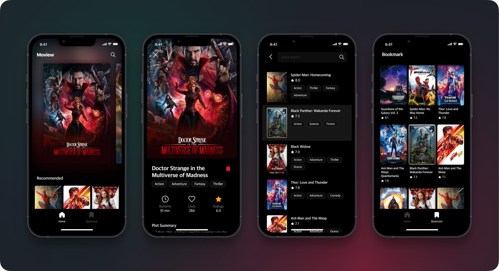
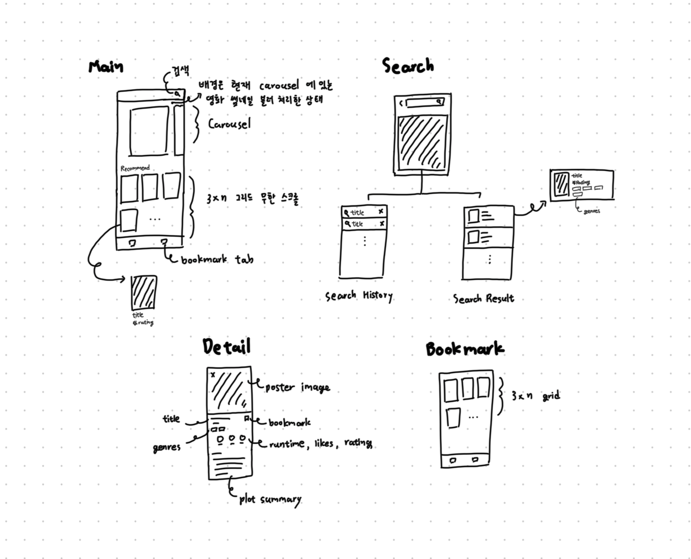
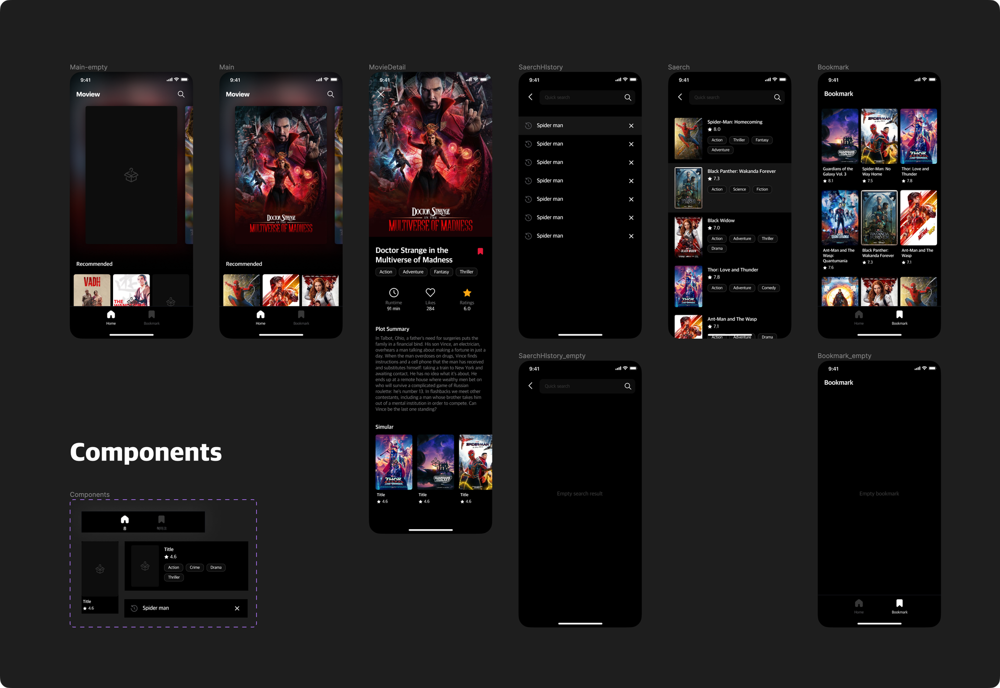

 
 <h1>Moview 무뷰</h1>
 <h4>프로그라피 과제 프로젝트</h4>

 
 
 

# 구상 및 설계
### 스토리보드
- 그려야하는 페이지가 많지 않은 경우 iPad의 freeform 앱을 이용해서 가볍게 스케치를 합니다.
- 디자인을 직접 하기 때문에 최소한의 정보만 포함한 상태로 디자인 작업을 합니다.

 
 
 

# 디자인
- 스토리보드를 바탕으로 구체적인 컨셉을 잡고 디자인을 합니다.
- 개발에 대한 이해가 있기 때문에 부분을 컴포넌트로 빼야할지 어떤 뷰를 프레임으로 감싸줘야 하는지에 대한 것 모두 고려해서 디자인 합니다.

 
 
 

# 👀 미리보기

|  | |  |  |
|---|---|---|---|
| 메인 | 영화 상세 | 북마크 | 디테일 |

### 메인
- 메인 화면에서는 상단에 영화 리스트 중 최신 10개를 뽑아서 보여줍니다.
- 그 아래로는 일반 영화 리스트를 격자 형태로 보여줍니다.
- 해당 상단, 하단 CollectionView 레이아웃은 UICompositionalLayout으로 구현하였습니다.
- 또한 UI적 아름다움을 위해서 UICollectionView 뒤로 UIBlurEffect와 Gradient를 적절히 섞어 앰비언트 조명을 구현해 주었습니다.
- 앰비언트 효과 뷰는 메인 collectionView contentOffset에 rx로 묶에 CollectionView를 내리면 같이 자연스럽게 올라갑니다.
- 네비게이션 뷰는 컬렉션뷰 컨텐츠를 올림에 따라서 자연스레 어두어 지도록 구현하였습니다.
- 메인 컬렉션뷰의 모든 셀들은 로딩하는 동안 SkeletonView를 통해 로딩 애니메이션이 재생됩니다.

 

### 영화 상세
- 영화 상세에서는 `런타임` `좋아요 수` `평점` `줄거리` `장르` 등을 확인할 수 있습니다.
- (메인 → 상세), (검색 결과 → 상세)로 넘어갈떄 hero 애니메이션을 통해서 자연스러운 사용자 경험을 제공합니다.
- 또한 상세에서 스크롤을 쭉 끌어내렸을 때 일정 수준을 지나면 해당 페이지에서 나갈 수 있도록 구현하였습니다.

 

### 북마크
- 사용자가 북마크한 영화들을 한 번에 모아 보여주는 페이지 입니다.
- Realm과 rx를 조합하여 데이터를 관리합니다.

 

### 검색 및 검색 기록
- 검색 기록 및 검색 결과 화면을 각각 서브 뷰컨으로 두고 뷰모델끼리 소통하여 output을 통해서 각 뷰컨에까지 결과로 보여질 수 있게 구현하였습니다.
